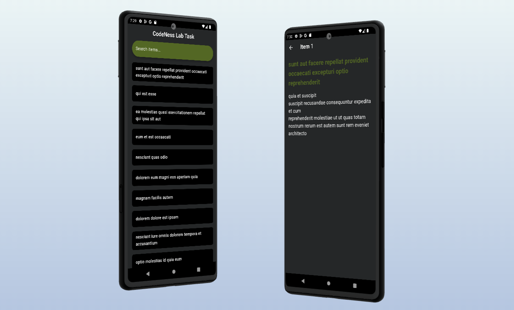

# 📱 Flutter MVVM Architecture with GetX

A Flutter application structured using the MVVM (Model-View-ViewModel) architecture pattern, leveraging GetX for state management, dependency injection, and routing. This architecture ensures a clean separation of concerns, scalability, and maintainability.

## 📸 Project Preview



## 📂 Project Structure

lib/
├── core/
│ ├── bindings/
│ │ └── app_bindings.dart
│ ├── constants/
│ │ ├── app_constants.dart
│ │ ├── color_manager.dart
│ │ └── strings_manager.dart
│ ├── routes/
│ │ └── app_routes.dart
│ └── networking/
│ ├── api_result.dart
│ ├── network_exceptions.dart
│ └── dio_factory.dart
│ └── error_model.dart
├── model/
│ ├── models/
│ │ └── item_model.dart
│ ├── repositories/
│ │ └── repo.dart
│ └── services/
│ ├── web_services.dart
│ └── web_services.g.dart
├── viewmodel/
│ └── item_controller.dart
├── view/
│ ├── item_list_view.dart
│ ├── item_detail_view.dart
│ └── widgets/
│ └── item_builder.dart
└── main.dart

## 🚀 Features

- **MVVM Architecture**: Clear separation of concerns with ViewModel handling business logic and Views displaying the UI.
- **Dynamic UI**: State managed reactively with **GetX** for efficient updates.
- **Reactive API Calls**: **Retrofit** and **Dio** enable smooth, reactive API integration.
- **Error Handling**: Custom error models and exceptions to handle network errors effectively.
- **Routing**: Manage navigation through **GetX**'s robust routing system.

## 🔧 Dependencies

- **GetX**: State management and routing.
- **Retrofit**: Network API calls with automatic response mapping.
- **Dio**: HTTP client for network requests.
- **Freezed**: Code generation for immutable data classes.
- **Build Runner**: Tool for code generation.

## 🛠️ Installation Guide

Follow these steps to set up and run the project locally:

### 1. **Clone the Repository**

Start by cloning the project repository to your local machine:

```bash
git clone https://github.com/your-repo/code_nes_lab_task.git
```

Navigate to the project directory:

```bash
cd code_nes_lab_task
```

### 2. **Set Up Flutter**

Ensure you have Flutter installed on your system. If not, follow the official Flutter installation guide.

Check your Flutter version to confirm installation:

```bash
flutter --version
```

Note: This project requires Flutter SDK 3.5.3 or later.

### 3. **Install Dependencies**

Run the following command to fetch all necessary dependencies:

```bash
flutter pub get
```

### 4. **Code Generation**

The project uses build_runner for code generation. Run the following command to generate the required files for models, APIs, and more:

```bash
flutter pub run build_runner build --delete-conflicting-outputs
```

### 5. **Run the Application**

Debug Mode
Run the app in debug mode:

```bash
flutter run
```

Release Mode
For optimized performance, build and run the app in release mode:

```bash
flutter build apk --release
```

Install the APK on your device:

```bash
flutter install
```

### 6. **Testing**

Run unit and widget tests to ensure the app functions as expected:

```bash
flutter test
```

### 7. **Optional: Enable Device Preview**

If you want to use the device_preview package for testing on multiple screen sizes:

Uncomment the DevicePreview setup in main.dart:

```dart
import 'package:device_preview/device_preview.dart';

// Wrap MaterialApp with DevicePreview
DevicePreview(
  builder: (context) => MyApp(),
);
```

Rebuild and run the application.

🎉 You're All Set! Now you can start exploring and contributing to the project. If you encounter any issues, feel free to open a ticket or reach out for help.

Please Let me know if you’d like to make further modifications!
